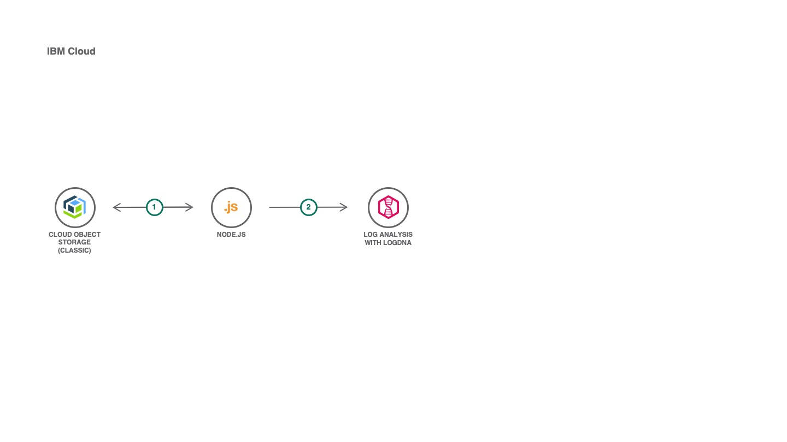

# LogDNA COS

[](https://cloud.ibm.com)
[](https://developer.ibm.com/technologies/node-js/)
[](https://github.com/victorshinya/logdna-cos/blob/master/LICENSE)
[](https://github.com/victorshinya/logdna-cos/pulls)

Use Serverless function or VM to send all log registries from IBM Cloud Object Storage (stored by `Log push` on IBM Cloud Internet Service) to IBM Log Analysis with LogDNA. It will require to setup a Trigger rule to call the function every 5 minutes (to be synced with CIS Log Push time interval).



## Deployment

To deploy, you need to install [IBM Cloud CLI](https://cloud.ibm.com/docs/cli/reference/ibmcloud/download_cli.html#install_use) and [IBM Cloud Functions CLI](https://cloud.ibm.com/openwhisk/learn/cli) in your local machine. After this step, you need to login in your IBM Cloud account on IBM Cloud CLI (if you haven't already done, run `ibmcloud login`), follow all steps below.

### 1. Clone this repository

```sh
git clone https://github.com/victorshinya/logdna-cos.git
cd logdna-cos
```

### 2. Open the project in a text editor

If you are going to run on a Serverless function replace all lines, described below.
Or if you're going to run on a VM, you can simply add all credencials on a .env file (follow the skeleton on [.env.example](.env.example)).

Replace on `handler.js`:

- [ Line 36 ] `{endpoint}` by your IBM Cloud Object Storage's endpoint.
- [ Line 37 ] `{apiKeyId}` by your IBM Cloud Object Storage's apiKeyId.
- [ Line 39 ] `{serviceInstanceId}` by your IBM Cloud Object Storage's serviceInstanceId.
- [ Line 47 ] `{bucketReceiver}` by your IBM Cloud Object Storage's bucket that will receive all log files from IBM Cloud Internet Service.
- [ Line 48 ] `{bucketArchive}` by your IBM Cloud Object Storage's bucket after sending all logs to LogDNA.
- [ Line 63 ] `{ingestionKey}` by your LogDNA's API Key.
- [ Line 64 ] `{host}` by your LogDNA's hostname (defined by you).

### 3. Deploy all functions

Run the following command to deploy `handler.js` function. It requires an account on [IBM Cloud](https://cloud.ibm.com).

> As you are using IBM Cloud Functions, you don't need to install any package or setup a `package.json`. The platform already has the package installed.

```sh
ibmcloud fn deploy --manifest serverless.yml
```

## Execute function on VM

In order to start the script on a VM, with a recursive mode, you have to uncomment all code below `DEBUG::` on [handler.js](handler.js) (do not uncomment the `DEBUG::` line):

```js
async function main() {
  console.time("LogDNA-COS");
  const response = await downloadAndSend();
  console.log(`DEBUG: downloadAndSend = ${JSON.stringify(response.message)}`);
  console.timeEnd("LogDNA-COS");
  // DEBUG::
  // switch (response.status) {
  //     case 200:
  //         console.log(`DEBUG: Fetch new log file`)
  //         await main()
  //         break
  //     case 204:
  //         console.log(`DEBUG: Wait 3 minutes to fetch new log file on COS Bucket`)
  //         await new Promise(r => setTimeout(r, 180000))
  //         await main()
  //         break
  //     default:
  //         console.log(`DEBUG: Uncommon behavior`)
  //         break
  // }
}

// DEBUG::
// main()
```

Don't forget to add all credencials on a .env file (follow the skeleton on [.env.example](.env.example)).

Tip: Use [pm2](https://www.npmjs.com/package/pm2) to run the script on background in your Virtual Machine.

## API Reference

- [IBM Cloud Object Storage AWS.S3](https://ibm.github.io/ibm-cos-sdk-js/AWS/S3.html)

## Troubleshooting

## LICENSE

Copyright 2020 Victor Shinya

Licensed under the Apache License, Version 2.0 (the "License");
you may not use this file except in compliance with the License.
You may obtain a copy of the License at

    http://www.apache.org/licenses/LICENSE-2.0

Unless required by applicable law or agreed to in writing, software
distributed under the License is distributed on an "AS IS" BASIS,
WITHOUT WARRANTIES OR CONDITIONS OF ANY KIND, either express or implied.
See the License for the specific language governing permissions and
limitations under the License.
