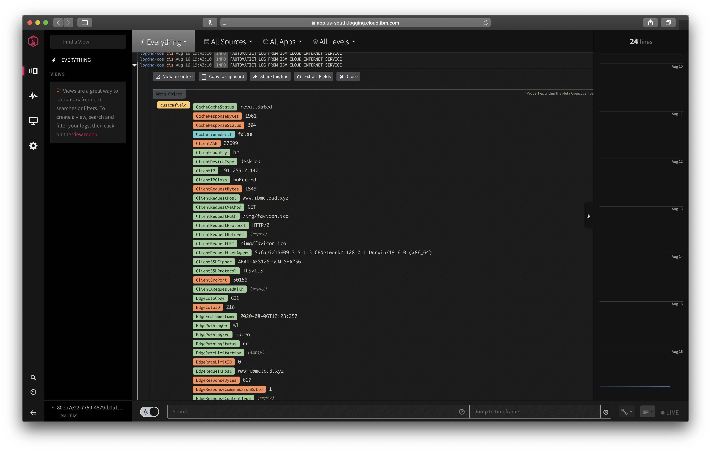

# Importing logs from Cloud Internet Services to LogDNA

[](https://cloud.ibm.com)
[](https://developer.ibm.com/technologies/node-js/)
[](https://github.com/victorshinya/logdna-cos/blob/master/LICENSE)
[](https://github.com/victorshinya/logdna-cos/pulls)

IBM Cloud™ Internet Services on Enterprise Plan offers a Logpush feature which sends at least 1 log package (on a `.gz` file) to a Bucket on a [Cloud Object Storage](https://cloud.ibm.com/catalog/services/cloud-object-storage) every 5 minutes. For those logs, there is a service called [IBM Log Analysis with LogDNA](https://cloud.ibm.com/catalog/services/ibm-log-analysis-with-logdna) that can receive all logs and display them in a single platform (you can send logs from your Kubernetes cluster, VMs, etc). To import all logs into LogDNA, you need to set up a Serverless function to check COS and send the logs to LogDNA every 3 minutes. It uses an Action and a Trigger (with a Cron job) to run the job automatically.


Before you follow step-by-step below, you need to install [IBM Cloud CLI](https://cloud.ibm.com/docs/cli/reference/ibmcloud/download_cli.html#install_use) and [IBM Cloud Functions CLI](https://cloud.ibm.com/openwhisk/learn/cli) in your local machine. Then, you need to login in your IBM Cloud account on IBM Cloud CLI (if you haven't already done, run `ibmcloud login`).

## 1. Clone this repository

Download the source code from Github and access the project folder.

```sh
git clone https://github.com/IBM/logdna-cos.git
cd logdna-cos
```

## 2. Create a Cloud Object Storage service instance

Access the IBM Cloud Catalog and create a [Cloud Object Storage](https://cloud.ibm.com/catalog/services/cloud-object-storage). After you create the instance, you have to create two Buckets in the same Resiliency and Location (e.g `Regional` and `us-south`):

- To receive the log files from CIS;
- To store the log files after you send the content to LogDNA.

Remember the name for each one of the Bucket name, because you're going to use them in the next step.

For your service instance, you need to create a Service credential. You can find it on the left menu in your COS instance. For the purpose of this project, you will use `apikey` and `iam_serviceid_crn`.

> You can find the Endpoint URL on `Endpoints`. The correct enpoint for your usecase depends on the Resilience and Location you choose when you create your Buckets. For more information, access the [IBM Cloud Docs](https://cloud.ibm.com/docs/cloud-object-storage?topic=cloud-object-storage-endpoints).

## 3. Create a IBM Log Analysis with LogDNA service instance

Access the IBM Cloud Catalog and create a [IBM Log Analysis with LogDNA](https://cloud.ibm.com/catalog/services/ibm-log-analysis-with-logdna). After you create the instance, you have to access the service by clicking on `View LogDNA` button.

Access the `Settings` -> `ORGANIZATION` -> `API Keys` to get your Ingestion Keys.

## 4. Open the project in a text editor

Open the project in any text editor your normally use (like VSCode or Atom). Open the `handler.js` file and replace the boilerplate with your LogDNA and Cloud Object Storage credentials, described below.

Replace on `handler.js`:

- [ Line 36 ] `{endpoint}` by your IBM Cloud Object Storage's endpoint.
- [ Line 37 ] `{apiKeyId}` by your IBM Cloud Object Storage's apiKeyId.
- [ Line 39 ] `{serviceInstanceId}` by your IBM Cloud Object Storage's serviceInstanceId.
- [ Line 47 ] `{bucketReceiver}` by your IBM Cloud Object Storage's bucket that will receive all log files from IBM Cloud Internet Service.
- [ Line 48 ] `{bucketArchive}` by your IBM Cloud Object Storage's bucket after sending all logs to LogDNA.
- [ Line 63 ] `{ingestionKey}` by your LogDNA's API Key.
- [ Line 64 ] `{host}` by your LogDNA's hostname (defined by you).

## 5. Deploy the Action and Trigger

Run the following command to deploy `handler.js` function and to set up the Trigger with Cron job.

> As you are using IBM Cloud Functions, you don't need to install any package or setup a `package.json`. The platform already has all libraries required to run the source code.

```sh
ibmcloud fn deploy --manifest serverless.yml
```

## 6. Enable and set up Logpush service

To set up the Logpush on Cloud Internet Services (CIS) and authorize CIS to send the log package to Object Storage, follow the step-by-step from [IBM Cloud Docs](https://cloud.ibm.com/docs/cis?topic=cis-logpush#logpush-setup-ui).

> Cloud Internet Services on Enterprise plan (Enterprise Package or Enterprise Usage) allows users to have access to detailed logs of HTTP and range requests for their domains. These logs help debug and analytics. A high volume of access by a given user can mean a possible DoS (Denial of Service) attack.

### This is an example log line for a single access to the URL

```json
{
  "CacheCacheStatus": "unknown",
  "CacheResponseBytes": 0,
  "CacheResponseStatus": 0,
  "CacheTieredFill": false,
  "ClientASN": 12876,
  "ClientCountry": "fr",
  "ClientDeviceType": "desktop",
  "ClientIP": "212.47.254.129",
  "ClientIPClass": "noRecord",
  "ClientRequestBytes": 977,
  "ClientRequestHost": "ibmcloud.xyz",
  "ClientRequestMethod": "GET",
  "ClientRequestPath": "/",
  "ClientRequestProtocol": "HTTP/1.1",
  "ClientRequestReferer": "http://ibmcloud.xyz/",
  "ClientRequestURI": "/",
  "ClientRequestUserAgent": "Mozilla/5.0 (Windows NT 10.0; Win64; x64) AppleWebKit/537.36 (KHTML, like Gecko) Chrome/84.0.4147.89 Safari/537.36",
  "ClientSSLCipher": "NONE",
  "ClientSSLProtocol": "none",
  "ClientSrcPort": 41978,
  "ClientXRequestedWith": "",
  "EdgeColoCode": "CDG",
  "EdgeColoID": 19,
  "EdgeEndTimestamp": "2020-08-05T22:06:14Z",
  "EdgePathingOp": "ban",
  "EdgePathingSrc": "filterBasedFirewall",
  "EdgePathingStatus": "nr",
  "EdgeRateLimitAction": "",
  "EdgeRateLimitID": 0,
  "EdgeRequestHost": "",
  "EdgeResponseBytes": 1864,
  "EdgeResponseCompressionRatio": 2.65,
  "EdgeResponseContentType": "text/html",
  "EdgeResponseStatus": 403,
  "EdgeServerIP": "",
  "EdgeStartTimestamp": "2020-08-05T22:06:14Z",
  "FirewallMatchesActions": ["drop"],
  "FirewallMatchesRuleIDs": ["570fd13c23eb4b49bcd8d585df59d14f"],
  "FirewallMatchesSources": ["firewallRules"],
  "OriginIP": "",
  "OriginResponseBytes": 0,
  "OriginResponseHTTPExpires": "",
  "OriginResponseHTTPLastModified": "",
  "OriginResponseStatus": 0,
  "OriginResponseTime": 0,
  "OriginSSLProtocol": "unknown",
  "ParentRayID": "00",
  "RayID": "5be3d2fdfc3fcd97",
  "SecurityLevel": "unk",
  "WAFAction": "unknown",
  "WAFFlags": "0",
  "WAFMatchedVar": "",
  "WAFProfile": "unknown",
  "WAFRuleID": "",
  "WAFRuleMessage": "",
  "WorkerCPUTime": 0,
  "WorkerStatus": "unknown",
  "WorkerSubrequest": false,
  "WorkerSubrequestCount": 0,
  "ZoneID": 259368151
}
```

After you set up the Logpush feature, it will start sending the log package to your Cloud Object Storage instance every 5 minutes, whether there was an access or not. For a large amount of access, you will see more than 1 log package (the `.gz` file) on COS. That is because Cloudflare splits the file to avoid a large file size (more than 3 GB per log package).

### Result on LogDNA

After you set up all the steps above, you will be able to see the logs being imported on LogDNA, as you can see on the image below.



## Run the project in a Virtual Machine

For a large amount of access to your domain, the IBM Cloud Functions will not be able to process a large file, even with the maximum capability. So in this case, you can run the source code in a Virtual Server on IBM Cloud.

To set up the project to run in a VM, you have to create a `.env` file and add the respective service credential (described on [.env.example](.env.example) file).

```.env
# IBM Log Analysis with LogDNA
LOGDNA_INGESTION_KEY=
LOGDNA_HOSTNAME=

# IBM Cloud Object Storage
COS_ENDPOINT=
COS_APIKEY=
COS_INSTANCEID=
COS_BUCKET_RECEIVER=
COS_BUCKET_ARCHIVE=
```

Then, you have to uncomment all the source code below `DEBUG::` on [handler.js](handler.js) (do not uncomment the `DEBUG::` line):

```js
async function main() {
  console.time("LogDNA-COS");
  const response = await downloadAndSend();
  console.log(`DEBUG: downloadAndSend = ${JSON.stringify(response.message)}`);
  console.timeEnd("LogDNA-COS");
  // DEBUG::
  switch (response.status) {
    case 200:
      console.log("DEBUG: Fetch new log file");
      await main();
      break;
    case 204:
      console.log("DEBUG: Wait 3 minutes to fetch new log file on COS Bucket");
      await new Promise((r) => setTimeout(r, 180000));
      await main();
      break;
    default:
      console.log("DEBUG: Uncommon behavior");
      break;
  }
}

// DEBUG::
main();
```

Tip: Use [pm2](https://www.npmjs.com/package/pm2) to run the script on background in your Virtual Machine.

## API Reference

- [IBM Cloud Object Storage AWS.S3](https://ibm.github.io/ibm-cos-sdk-js/AWS/S3.html)

## Troubleshooting

## LICENSE

Copyright 2020 Victor Shinya

Licensed under the Apache License, Version 2.0 (the "License");
you may not use this file except in compliance with the License.
You may obtain a copy of the License at

    http://www.apache.org/licenses/LICENSE-2.0

Unless required by applicable law or agreed to in writing, software
distributed under the License is distributed on an "AS IS" BASIS,
WITHOUT WARRANTIES OR CONDITIONS OF ANY KIND, either express or implied.
See the License for the specific language governing permissions and
limitations under the License.
